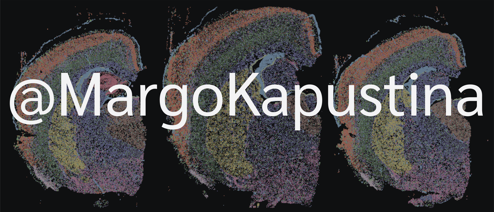

# Margarita Kapustina
👋 Hey there, I’m @MargoKapustina! I'm a PhD student in Neuroscience in the [Cembrowski Lab](https://www.cembrowskilab.com/) at the University of British Columbia. 

  

   

### Interests
🧬  How leveraging spatially patterned gene expression in the brain can reveal heterogenous higher-order cellular properties across neuronal populations.    
🛠️  I am also interested in developing automated discovery-based cell-type-specific analyses across high-throughput omics technologies. I enjoy building tools that streamline the analysis of big omics data.  
🌐  I support transparant research and open science initiatives, so that scientific discoveries can be accesible and reproducible within the scientific community.   

### My Repos
- [R Package for Xenium Spatial Analysis](https://github.com/MargoKapustina/XeniumSpatialAnalysis)  
### My Collaborations at the Cembrowski Lab
- [R-based Utilities for HiPlex mFISH (RUHi)](https://github.com/cembrowskilab/RUHi)  
- [RUHi Step-by-Step Tutorials](https://kaitsull.github.io/VideoTutorials/09_geographic-analysis.html)  

### Currently Learning & Creating...
🌱  Automated registration and streamlined analysis of multimodal single-cell spatial datasets.

### Collaboratation
🔗  I'm open to collaborating on work automating and quantifying histology, as well as unique approaches to analyzing big omics data.  
